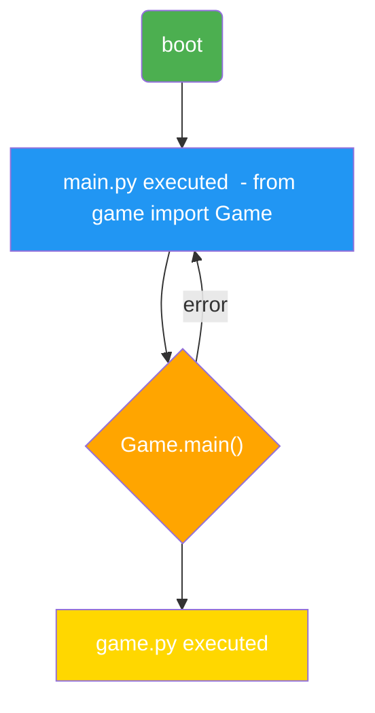

# launchpad-MAX7219
Micro-OS for the MAX7219 8x8 matrix display - coded for the RPi Pico/Pico 2 in MicroPython
## What even is this?
I opensourced this project so a full ecoystem can be developed for this very niche "OS." I have already included one game (ingeniously named *Game1*), but it is very basic, and (as of now) is on the verge of even being *classified* as a video game. I encourage you, as the user, to develop your own games for it using [MicroPython](https://micropython.org/download/) for the Raspberry Pi Pico or Pico 2.
## How does it work?
The `main.py` and any other added `.py` file should use the [`micropython-max7219`](https://github.com/mcauser/micropython-max7219) driver for 8x8 LED matrices. Any editor that allows USB serial communication is fine, but I personally use the [Thonny](https://thonny.org/) IDE for Python/MicroPython. To add a new game, use this format:
```python title=game.py
class Game:
  def main(self):
    ...
```
As shown in `main.py` file, each game is a file and the main class is imported from it (i.e. `from game1 import Game1`). After this, the `main()` function from that class is called with **zero** parameters. And that's basically it. `mermaid` flowchart:

## What else will *I* do?
Expect me to improve the already checked ones -
- [x] Core OS
- [ ] Finish Sample Game
  - [ ] Content
  - [x] Input system
- [ ] Documentation

## License
Copyright 2026 LeifGCH

Licensed under the [MIT License](https://opensource.org/license/MIT).
